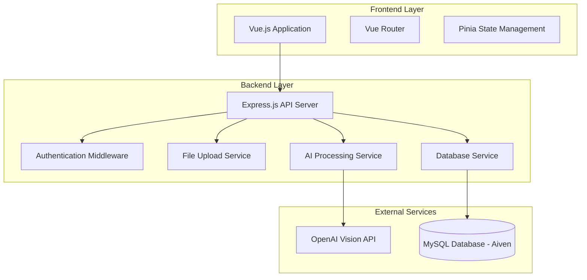

# Design Document

## Overview

The AI-powered school fee payment portal is a full-stack web application that modernizes the existing desktop-based fee management system. The solution consists of a Vue.js frontend for user interaction and a Node.js backend with Express.js for API services, AI integration, and database operations. The system integrates with OpenAI's Vision API for image analysis and connects to the existing MySQL database hosted on Aiven.

## Architecture

### System Architecture



### Technology Stack

**Frontend:**

- Vue.js 3 with Composition API
- Vue Router for navigation
- Pinia for state management
- Tailwind CSS for styling
- Axios for HTTP requests
- Vue3-dropzone for file uploads

**Backend:**

- Node.js with Express.js
- Multer for file upload handling
- MySQL2 for database connectivity
- OpenAI SDK for AI integration
- bcrypt for password hashing
- jsonwebtoken for authentication
- Liquibase for database migrations

## Components and Interfaces

### Frontend Components

#### 1. Authentication Components

- **LoginForm.vue**: User login interface
- **AuthGuard.vue**: Route protection component

#### 2. File Upload Components

- **ImageUploader.vue**: Drag-and-drop image upload interface
- **InstructionPanel.vue**: AI instruction input component

#### 3. Data Processing Components

- **ExtractionTable.vue**: Editable table for AI-extracted data
- **StudentMatcher.vue**: Student matching interface
- **ConfirmationTable.vue**: Final review and confirmation table

#### 4. Utility Components

- **LoadingSpinner.vue**: Processing indicator
- **ErrorAlert.vue**: Error message display
- **SuccessNotification.vue**: Success feedback

### Backend API Endpoints

#### Authentication Endpoints

```
POST /api/auth/login
POST /api/auth/logout
GET /api/auth/verify
```

#### File Processing Endpoints

```
POST /api/upload/image
POST /api/process/extract
POST /api/process/match-students
```

#### Database Endpoints

```
GET /api/students/search
POST /api/payments/batch-insert
GET /api/payments/history
```

### Data Models

#### ExtractedPayment Model

```typescript
interface ExtractedPayment {
  id: string;
  amount: number;
  transactionRef: string;
  studentName: string;
  className: string;
  confidence: number;
  isEdited: boolean;
}
```

#### StudentMatch Model

```typescript
interface StudentMatch {
  adm: number;
  name1: string;
  name2: string;
  name3?: string;
  class: number;
  stream?: number;
  currentBalance: number;
  matchConfidence: number;
}
```

#### PaymentRecord Model

```typescript
interface PaymentRecord {
  extractedPayment: ExtractedPayment;
  matchedStudent?: StudentMatch;
  isMatched: boolean;
  newBalance: number;
  overpayment?: number;
  status: "pending" | "confirmed" | "error";
}
```

## Data Models

### Database Schema Extensions

The system will work with the existing database schema but may require additional tables for audit logging and session management:

#### Session Management (New Table)

```sql
CREATE TABLE user_sessions (
  session_id VARCHAR(255) PRIMARY KEY,
  user_id INT NOT NULL,
  created_at TIMESTAMP DEFAULT CURRENT_TIMESTAMP,
  expires_at TIMESTAMP NOT NULL,
  is_active BOOLEAN DEFAULT TRUE,
  FOREIGN KEY (user_id) REFERENCES user(user_id)
);
```

#### Processing Log (New Table)

```sql
CREATE TABLE processing_log (
  log_id INT AUTO_INCREMENT PRIMARY KEY,
  user_id INT NOT NULL,
  action_type ENUM('upload', 'extract', 'match', 'confirm', 'insert') NOT NULL,
  details JSON,
  timestamp TIMESTAMP DEFAULT CURRENT_TIMESTAMP,
  FOREIGN KEY (user_id) REFERENCES user(user_id)
);
```

### AI Integration

#### OpenAI Vision API Integration

The system uses OpenAI's GPT-4 Vision model to analyze bank statement images:

```typescript
interface AIExtractionRequest {
  imageBase64: string;
  customInstructions?: string;
  documentType?: string;
}

interface AIExtractionResponse {
  extractedData: ExtractedPayment[];
  processingNotes: string;
  confidence: number;
}
```

#### AI Prompt Engineering

The system uses structured prompts to ensure consistent extraction:

```
Analyze this bank statement image and extract payment information for each row.
For each transaction, extract:
1. Amount from the AMOUNT column
2. Transaction reference from TRANSACTION REFERENCE NO column
3. Student name and class from ACCOUNT NAME column
4. Parse ACCOUNT NAME as: [FirstName] [Class] [LastName]

Custom Instructions: {userInstructions}

Return data as JSON array with fields: amount, transactionRef, studentName, className, confidence
```

## Error Handling

### Frontend Error Handling

- Network connectivity errors
- File upload validation errors
- AI processing timeouts
- Authentication failures
- Form validation errors

### Backend Error Handling

- Database connection failures
- AI API rate limiting
- File processing errors
- Authentication token expiration
- Data validation errors

### Error Response Format

```typescript
interface ErrorResponse {
  success: false;
  error: {
    code: string;
    message: string;
    details?: any;
  };
  timestamp: string;
}
```

## Testing Strategy

### Frontend Testing

- **Unit Tests**: Vue component testing with Vue Test Utils
- **Integration Tests**: API integration testing with mock services
- **E2E Tests**: Cypress for complete user workflow testing

### Backend Testing

- **Unit Tests**: Jest for individual service testing
- **Integration Tests**: Database and AI API integration testing
- **API Tests**: Supertest for endpoint testing

### Test Scenarios

1. **Image Upload Flow**: Test various image formats and sizes
2. **AI Extraction Accuracy**: Test with sample bank statements
3. **Student Matching Logic**: Test fuzzy matching algorithms
4. **Database Operations**: Test payment insertion and balance updates
5. **Authentication Flow**: Test login, session management, and logout
6. **Error Scenarios**: Test network failures, invalid data, and edge cases

### Performance Testing

- Image processing performance with large files
- Database query optimization for student searches
- Concurrent user handling
- AI API response time monitoring

## Security Considerations

### Authentication & Authorization

- JWT-based authentication with secure token storage
- Role-based access control for different user types
- Session timeout and automatic logout
- Password hashing with bcrypt

### Data Security

- HTTPS enforcement for all communications
- SSL/TLS encryption for database connections
- Input validation and sanitization
- File upload security (type validation, size limits)
- SQL injection prevention with parameterized queries

### AI Integration Security

- API key management and rotation
- Rate limiting for AI service calls
- Data privacy compliance for image processing
- Secure handling of sensitive financial data

## Deployment Architecture

### Development Environment

- Local MySQL database or Docker container
- Environment variables for configuration
- Hot reload for frontend development
- Nodemon for backend development

### Production Environment

- Aiven MySQL database with SSL
- Environment-based configuration
- Process management with PM2
- Reverse proxy with Nginx
- SSL certificate management

### Database Migration Strategy

- Liquibase changesets for schema updates
- Rollback capabilities for failed deployments
- Environment-specific migration tracking
- Backup procedures before major changes
